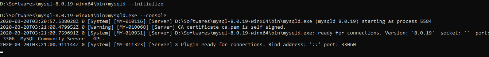
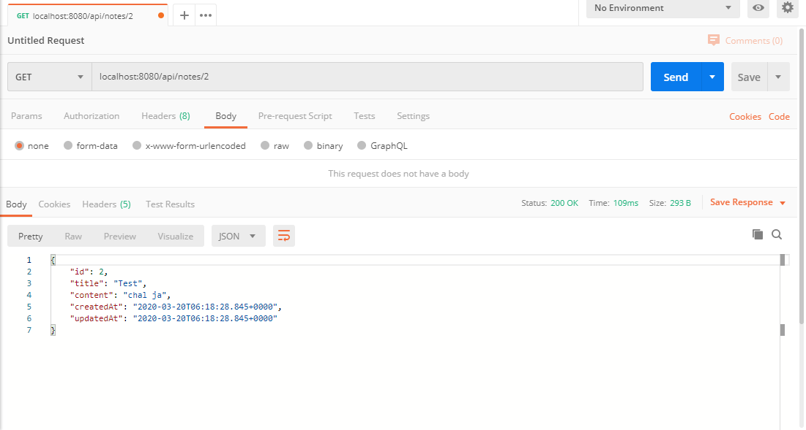

# SPRING-BOOT-HIBERNATE

## Install and Setup MySQL

1. Download the MySQL zip
2. Unzip the downloaded file and open the command line at the unziped location, go to `bin` directory
3. To initialize the MySQL run the below mentioned command, it will create the data directory in the same folder

        mysqld  --initialize-insecure
4. To start the server 

        mysqld.exe --console

    
5. Done with the setup, we can start with the MySQL to start the SQL

        mysql -u root
    
6. Create database 

        CREATE DATABASE hibernate_test;
    
    
7. Create table

        CREATE TABLE notes (
            id INT(6) UNSIGNED AUTO_INCREMENT PRIMARY KEY,
            title VARCHAR(30) NOT NULL,
            content VARCHAR(30) NOT NULL,
            createdAt DATE, 
            updatedAt DATE
        );
    
    
## Dependency

```xml
<dependency>
	<groupId>mysql</groupId>
	<artifactId>mysql-connector-java</artifactId>
</dependency>
```

## Properties

In the file `application.properties` declare the properties for sql
```
spring.datasource.url=jdbc:mysql://localhost:3306/hibernate_test
spring.datasource.username=root
```

* *spring.datasource.url* - this is to make the connection between the mysql and your program. 
    1. *localhost* is the address where the mysql is running
    2. *3306* port on which mysql is running
    3. *hibernate_test* is the database name which we have created above

* *spring.datasource.username* - this is the username to connect to the database. 

> As we have initialize the database as `insecure` we doesn't need to declare the password. If wants we declare as 
**spring.datasource.password=root**


## Test
1. Creating a new Note

    ```curl
    curl --location --request POST 'localhost:8080/api/notes/' \
    --header 'Content-Type: application/json' \
    --data-raw '{"title": "Plz","content": "Chal Ja"}'
    ```
    
2. Retrieving all Notes 

    ```curl
    curl --location --request GET 'localhost:8080/api/notes/' \
    --header 'Content-Type: application/json'
    ```

    
3. Retrieving a single Note

    ```curl
    curl --location --request GET 'localhost:8080/api/notes/2' \
    --header 'Content-Type: application/json'
    ```

    
4. Updating a Note

    ```curl
    curl --location --request PUT 'localhost:8080/api/notes/2' \
    --header 'Content-Type: application/json' \
    --data-raw '{"title": "Task","content": "Complete Spring Boot Hibernate Test"}'
    ```

    
5. Deleting a Note

    ```curl
    curl --location --request DELETE 'localhost:8080/api/notes/1' \
    --header 'Content-Type: application/json' \
    --data-raw ''
    ```

    
    